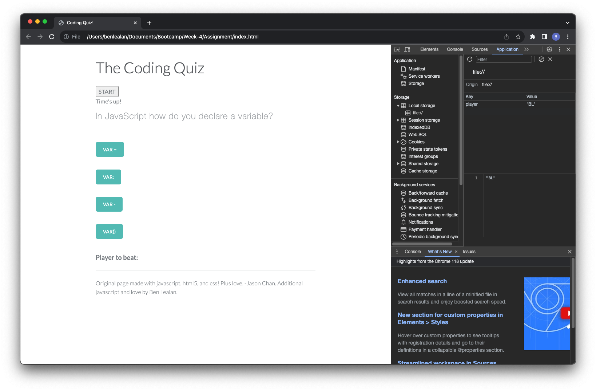

# Week 4 Assignment - Coding Quiz

## Description

The task was to create a multiple choice quiz for users to test their coding knowledge! Using an existing quiz template from codepen (source in credits) I copied across the HTML and CSS files as the foundations of the quiz, allowing me to focus on the JavaScript. Some basic changes were made to the HTML content to make it relevant to this task.

Starting with the variables, I ensured that HTML elements that would be required to manipulate were available to JavaScript. The initialising event would be the click of the "start button" so, an eventListener would register this, start the timer countdown and display the first question. While the quiz is in progress this start button is disabled, as otherwise it could be clicked to restart the timer!

When the timer reaches 0 a prompt appears for the user to input their initials to be saved to local storage.

These were the elements I was successfully able to implement. However, due to scheduling from my employer this week I was left with less time to work on this project than needed. The next steps included:

- working out a "for loop" to iterate through each question
- checking for correct answers to progress question/incorrect answers would minus time from counter
- styling green/red for correct/incorrect answers respectively
- recalling the saved initials and score from the local device to display on the page

## Usage

Below is a link to the live site and screenshots of the page showing it deployed:

-https://blealan.github.io/coding-quiz-b-lealan/

## Credits

- https://codepen.io/jasonchan/pen/wMaEwN
- https://www.w3schools.com/
- https://developer.mozilla.org/en-US/
