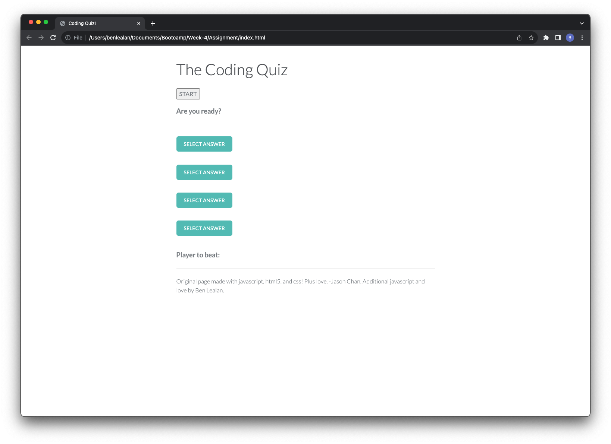
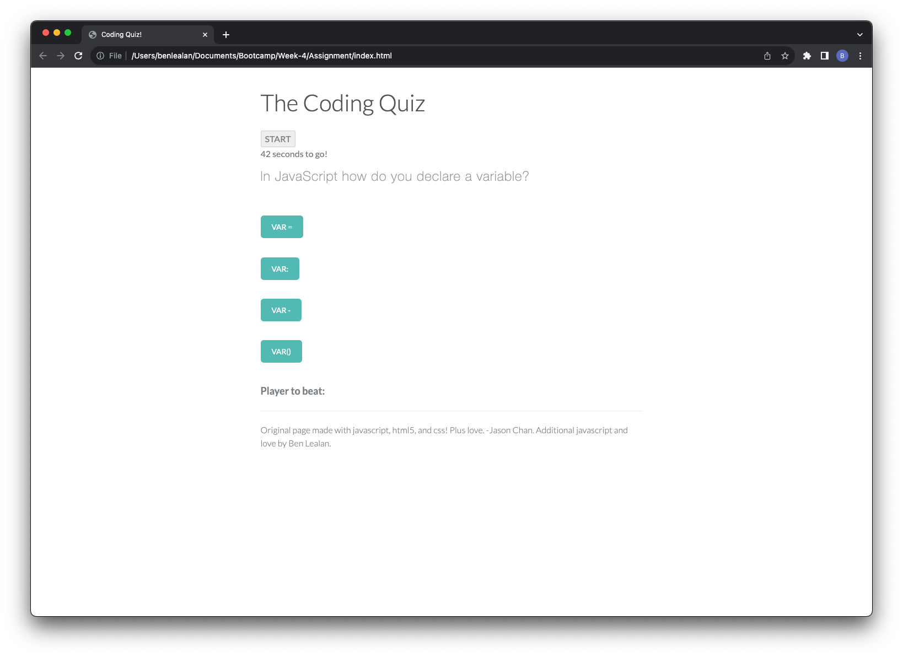
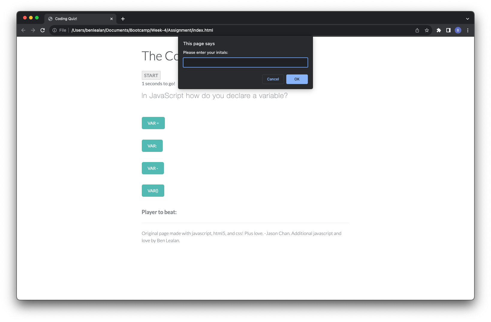

# Week 4 Assignment - Coding Quiz

## Description

The task was to create a multiple choice quiz for users to test their coding knowledge! Using an existing quiz template from codepen (source in credits) I copied across the HTML and CSS files as the foundations of the quiz, allowing me to focus on the JavaScript. Some basic changes were made to the HTML content to make it relevant to this task.

Starting with the variables, I ensured that HTML elements that would be required to manipulate were available to JavaScript. The initialising event would be the click of the "start button" so, an eventListener would register this, start the timer countdown and disaply the first question. While the quiz was in progress this start button was disabled, as otherwise it would restart the timer!

When the timer reaches 0 a prompt appears for the user to input their initials to be saved to local storage. 

## Usage

Below is a link to the live site and screenshots of the page showing it deployed:

## Credits

- https://codepen.io/jasonchan/pen/wMaEwN